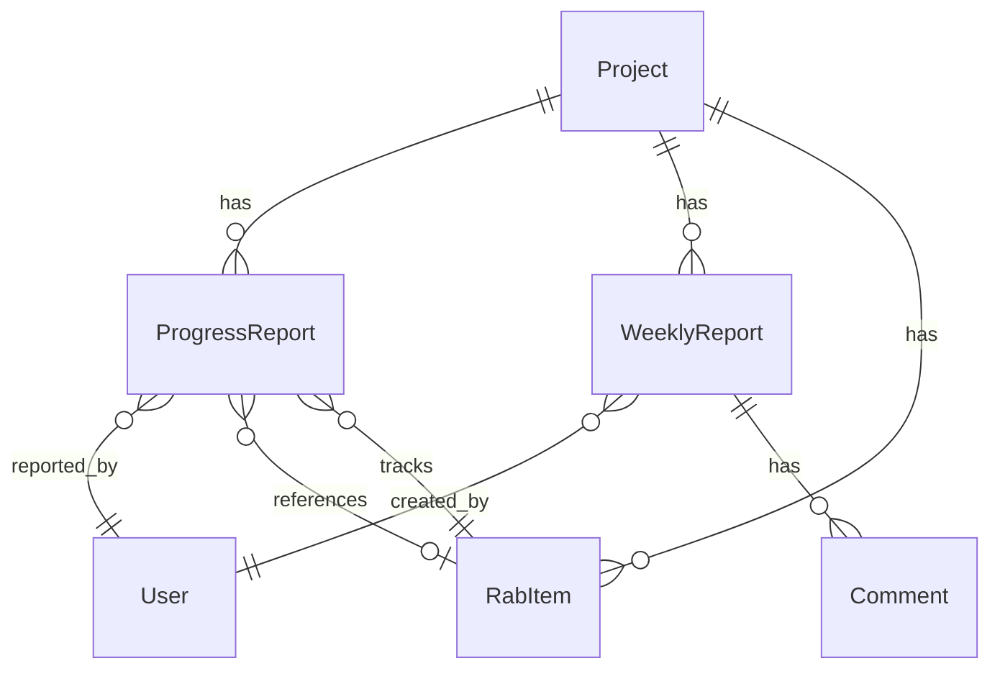
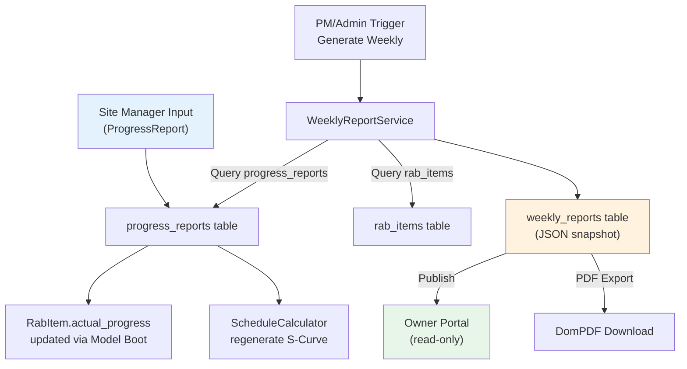
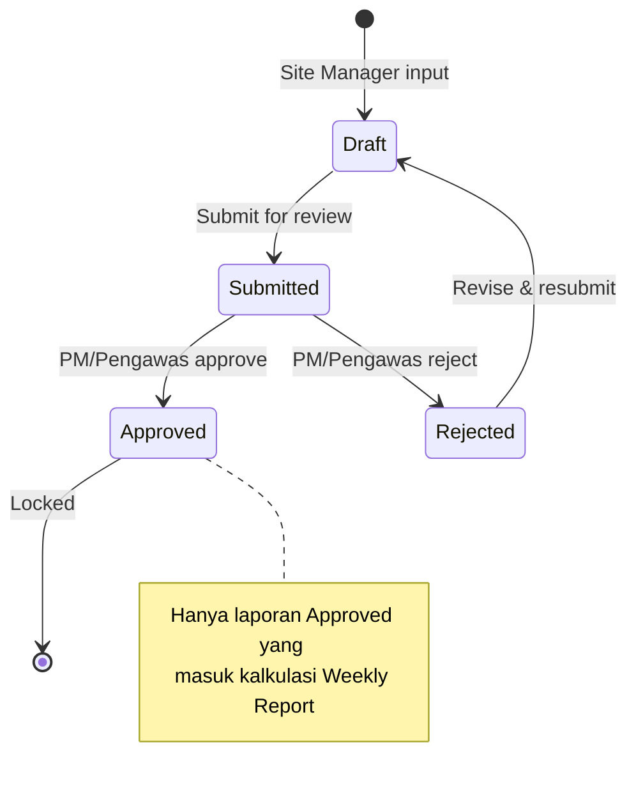
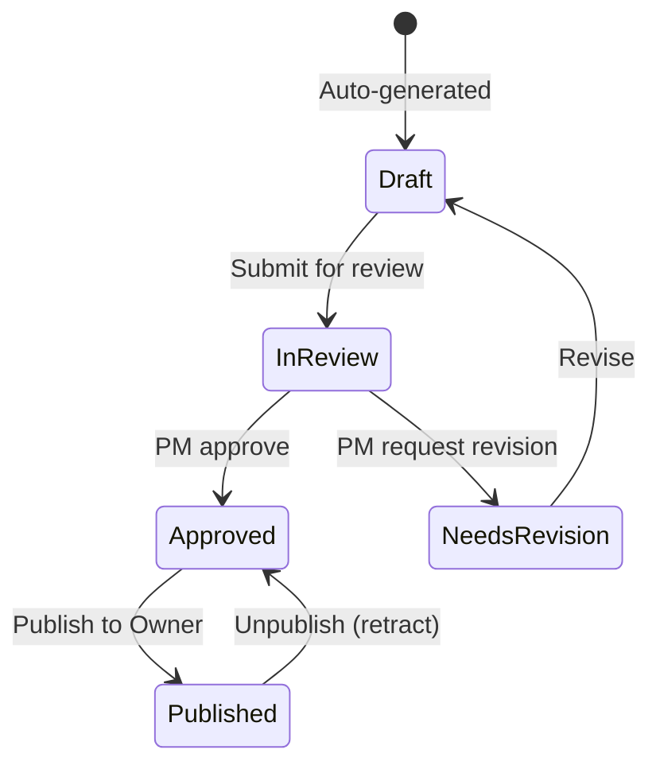

# Analisis Komprehensif & Rekomendasi Refactoring
## Modul Progress Report & Weekly Report — BEGE ProMan5

> **Tanggal:** 1 Mei 2026  
> **Scope:** Analisis arsitektur, workflow, dan data-flow antara modul Progress Report (Daily Log) dan Weekly Report, beserta rekomendasi refactoring berdasarkan best practice industri konstruksi.

---

## Daftar Isi

1. [Ringkasan Eksekutif](#1-ringkasan-eksekutif)
2. [Arsitektur Saat Ini (As-Is)](#2-arsitektur-saat-ini-as-is)
3. [Temuan Masalah Kritis](#3-temuan-masalah-kritis)
4. [Referensi Best Practice Industri](#4-referensi-best-practice-industri)
5. [Rekomendasi Refactoring](#5-rekomendasi-refactoring)
6. [Rencana Implementasi](#6-rencana-implementasi)

---

## 1. Ringkasan Eksekutif

Modul Progress Report dan Weekly Report merupakan inti pelaporan proyek konstruksi. Setelah analisis mendalam terhadap seluruh file terkait, ditemukan **7 masalah arsitektur kritis** dan **12 area perbaikan** yang perlu ditangani. Rekomendasi disusun dengan mengacu pada standar pelaporan PUPR Indonesia dan best practice dari aplikasi seperti **Procore**, **Buildertrend**, dan **Fieldwire**.

### Skor Kematangan Saat Ini

| Aspek | Skor | Target |
|:------|:----:|:------:|
| Separation of Concerns | 4/10 | 8/10 |
| Data Integrity | 5/10 | 9/10 |
| Workflow Completeness | 4/10 | 8/10 |
| Compliance (PUPR) | 3/10 | 8/10 |
| Code Duplication | 3/10 | 8/10 |

---

## 2. Arsitektur Saat Ini (As-Is)

### 2.1 Entity Relationship



### 2.2 File yang Terlibat

| Layer | File | LOC | Peran |
|:------|:-----|:---:|:------|
| **Model** | `ProgressReport.php` | 118 | Entity laporan harian per item RAB |
| **Model** | `WeeklyReport.php` | 162 | Entity laporan mingguan (snapshot) |
| **Model** | `RabItem.php` | 141 | Item pekerjaan dengan bobot & progress |
| **Controller** | `ProgressReportController.php` | 153 | CRUD + notifikasi progress harian |
| **Controller** | `WeeklyReportController.php` | 849 | CRUD + AJAX + cascade + PDF |
| **Livewire** | `ProgressReportManager.php` | 232 | UI interaktif input progress |
| **Service** | `WeeklyReportService.php` | 518 | Kalkulasi kumulatif & detail data |
| **Service** | `ScheduleCalculator.php` | 448 | S-Curve & jadwal otomatis |
| **API** | `Api\ProgressReportController.php` | 101 | Mobile API progress |
| **Portal** | `Portal\Owner\WeeklyReportController.php` | 60 | Akses owner ke laporan |

### 2.3 Data Flow Saat Ini



---

## 3. Temuan Masalah Kritis

### 3.1 🔴 Duplikasi Logika Besar-besaran (CRITICAL)

**WeeklyReportController.php** menduplikasi hampir seluruh method dari **WeeklyReportService.php**:

```diff
# WeeklyReportController.php (L616-L816)
- protected function cascadeToSubsequentWeeks(...)  # 55 baris — DUPLIKAT
- protected function collectItemCumulatives(...)     # 10 baris — DUPLIKAT  
- protected function cascadeSectionItems(...)        # 30 baris — DUPLIKAT
- protected function updateSectionItems(...)         # 30 baris — DUPLIKAT

# WeeklyReportService.php (L390-L515) 
+ public function updateCumulativeActuals(...)       # Method yang seharusnya dipanggil
+ protected function cascadeToSubsequentWeeks(...)   # Versi canonical
+ protected function cascadeSectionItems(...)        # Versi canonical
+ protected function updateSectionItems(...)         # Versi canonical
```

**Dampak:** Bug fix harus dilakukan di 2 tempat; inkonsistensi logika cascade antara controller dan service.

### 3.2 🔴 Tidak Ada Service Layer untuk Progress Report

Progress Report **tidak memiliki Service class** — semua business logic tersebar di:
- `ProgressReportController.php` (web)
- `ProgressReportManager.php` (Livewire)
- `Api\ProgressReportController.php` (API)

Kalkulasi kumulatif progress diulang di 3 tempat:

```php
// Controller (L77-80)
$validated['cumulative_progress'] = min(100, $rabItem->actual_progress + $validated['progress_percentage']);

// Livewire (L143-146)  
$data['cumulative_progress'] = min(100, $rabItem->actual_progress + $this->progressPercentage);

// API (L56-58)
$validated['cumulative_progress'] = min(100, $rabItem->actual_progress + $validated['progress_percentage']);
```

### 3.3 🔴 Race Condition pada Kalkulasi Kumulatif

Kalkulasi `cumulative_progress` menggunakan `actual_progress` saat ini tanpa database lock:

```php
// Jika 2 user submit progress untuk RAB item yang sama secara bersamaan:
// User A: cumulative = 50 + 10 = 60 ✓
// User B: cumulative = 50 + 15 = 65 ✗ (seharusnya 60 + 15 = 75)
```

**Tidak ada** `DB::transaction()` atau pessimistic locking pada proses ini.

### 3.4 🟠 Inkonsistensi Delete Logic

```php
// Controller: recalculate via SUM (SALAH untuk cumulative model)
$actualProgress = ProgressReport::where('rab_item_id', $rabItem->id)
    ->sum('progress_percentage');  // SUM ≠ latest cumulative

// Model Boot: recalculate via latest report (BENAR)
$latestReport = $model->rabItem->progressReports()
    ->orderByDesc('report_date')->orderByDesc('id')->first();
```

### 3.5 🟠 Tidak Ada Approval Workflow untuk Weekly Report

Status hanya `draft` → `published` (toggle langsung). Tidak ada:
- Proses review/approval oleh PM atau Direksi
- Audit trail siapa yang meng-approve
- Revisi history setelah publish

### 3.6 🟠 Data Laporan Harian Tidak Lengkap (Standar PUPR)

Berdasarkan standar PUPR, laporan harian wajib mencakup:

| Komponen PUPR | Status Saat Ini |
|:------|:----:|
| Tenaga kerja (jumlah) | ✅ `workers_count` |
| Tenaga kerja (klasifikasi: mandor/tukang/pekerja) | ⚠️ Partial via `labor_details` JSON |
| Peralatan (jenis, jumlah, kondisi) | ❌ Tidak ada |
| Bahan/Material (stok masuk, terpakai) | ❌ Terpisah di modul Usage |
| Kondisi cuaca + durasi | ⚠️ Ada cuaca, tanpa durasi |
| K3/Keselamatan | ❌ Tidak ada |
| Rencana kerja esok hari | ❌ Tidak ada |
| Foto dokumentasi | ✅ Ada |

### 3.7 🟡 Weekly Report Controller Terlalu Besar (849 LOC)

Controller ini menangani 17 action methods — jauh melampaui Single Responsibility:
- CRUD (5 methods)
- AJAX partial updates (6 methods)
- Photo/doc management (4 methods)
- Cascade logic (3 private methods)
- PDF export (1 method)

---

## 4. Referensi Best Practice Industri

### 4.1 Procore (Global Leader)

| Konsep | Implementasi Procore | Relevansi untuk ProMan5 |
|:-------|:--------------------|:----------------------|
| **Daily Log** | Entry terstruktur per kategori: Labor, Equipment, Material, Weather, Safety, Notes | Perluas ProgressReport |
| **Review Workflow** | Submit → Pending → Approve/Reject → Complete (lock) | Tambah approval layer |
| **Weekly Report** | Aggregasi otomatis dari Daily Log, bukan input manual | Sudah sebagian ada |
| **Auto Weather** | Otomatis dari API berdasarkan lokasi project | Nice-to-have |

### 4.2 Buildertrend & Fieldwire

| Konsep | Implementasi | Relevansi |
|:-------|:------------|:---------|
| **Daily Journal** | Voice-to-text, GPS stamping, task-linked photos | Mobile-ready design |
| **Safety Tracking** | Dedicated safety forms, incident reporting | Wajib per PUPR |
| **Auto-copy** | Copy dari laporan kemarin untuk field repetitif | UX improvement |
| **Email Schedule** | Auto-email daily log ke stakeholder | Notifikasi otomatis |

### 4.3 Standar PUPR Indonesia

Berdasarkan regulasi Kementerian PUPR:
1. **Laporan Harian** → direkap menjadi **Laporan Mingguan** → direkap menjadi **Laporan Bulanan**
2. Dibuat oleh Kontraktor, diverifikasi Konsultan Pengawas, disetujui Direksi Lapangan
3. Wajib mencakup: Tenaga Kerja, Peralatan, Material, Cuaca, K3, Kendala
4. Didistribusikan ke 4 pihak: PPK, Konsultan MK, Konsultan Pengawas, Kontraktor

---

## 5. Rekomendasi Refactoring

### 5.1 Buat `ProgressReportService` (PRIORITAS 1)

Konsolidasikan semua business logic ke satu service:

```php
// app/Services/ProgressReportService.php
class ProgressReportService
{
    public function create(Project $project, array $data, ?User $reporter = null): ProgressReport
    {
        return DB::transaction(function () use ($project, $data, $reporter) {
            // 1. Lock RAB item untuk prevent race condition
            $rabItem = $data['rab_item_id'] 
                ? RabItem::lockForUpdate()->find($data['rab_item_id']) 
                : null;
            
            // 2. Kalkulasi kumulatif (single source of truth)
            if ($rabItem) {
                $data['cumulative_progress'] = min(100, 
                    $rabItem->actual_progress + $data['progress_percentage']
                );
            }
            
            // 3. Handle photo uploads
            $data['photos'] = $this->processPhotos($data['photos'] ?? [], $project);
            
            // 4. Create report
            $report = ProgressReport::create($data);
            
            // 5. Update RAB item
            if ($rabItem) {
                $rabItem->update(['actual_progress' => $report->cumulative_progress]);
                app(ScheduleCalculator::class)->updateFromProgress($project);
            }
            
            // 6. Notify
            $this->notifyTeam($report);
            
            return $report;
        });
    }
    
    public function delete(ProgressReport $report): void { /* ... */ }
    
    public function recalculateRabProgress(RabItem $rabItem): float { /* ... */ }
}
```

**Manfaat:**
- Satu titik kalkulasi kumulatif (eliminasi duplikasi di 3 tempat)
- `DB::transaction` + `lockForUpdate` mencegah race condition
- Controller/Livewire/API tinggal memanggil service

### 5.2 Refactor `WeeklyReportController` (PRIORITAS 1)

Hapus duplikasi dan delegasikan ke service:

```diff
# WeeklyReportController.php — BEFORE: 849 LOC, AFTER: ~250 LOC

  public function updateCumulative(Request $request, Project $project, WeeklyReport $report)
  {
      $this->authorize('weekly_report.manage');
-     // ... 55+ baris logika cascade langsung di controller
+     $result = $this->service->updateCumulativeActuals($report, $request->input('items'));
      
      return response()->json([
          'success' => true,
-         'message' => $message,
+         'message' => $result['message'],
-         'cumulative_data' => $data,
+         'cumulative_data' => $result['data'],
-         'cascaded_weeks' => $cascadeCount,
+         'cascaded_weeks' => $result['cascaded_count'],
      ]);
  }

- // HAPUS: 4 private methods yang duplikat dari Service (~125 LOC)
- protected function cascadeToSubsequentWeeks(...) { }
- protected function collectItemCumulatives(...) { }
- protected function cascadeSectionItems(...) { }
- protected function updateSectionItems(...) { }
```

### 5.3 Perkuat Data Model Progress Report (PRIORITAS 2)

Tambahkan field sesuai standar PUPR dan best practice industri:

```php
// Migration: add_pupr_fields_to_progress_reports
Schema::table('progress_reports', function (Blueprint $table) {
    // Peralatan
    $table->json('equipment_details')->nullable();
    // Format: [{"name":"Excavator","qty":2,"condition":"baik","hours":8}]
    
    // Material harian
    $table->json('material_usage_summary')->nullable();
    // Format: [{"material":"Semen","qty_used":50,"unit":"sak"}]
    
    // K3 / Safety
    $table->json('safety_details')->nullable();
    // Format: {"incidents":0,"near_miss":0,"apd_compliance":true,"notes":""}
    
    // Cuaca detail
    $table->string('weather_duration')->nullable();
    // "3 jam hujan pagi"
    
    // Rencana esok hari
    $table->text('next_day_plan')->nullable();
    
    // Approval workflow
    $table->enum('status', ['draft','submitted','approved','rejected'])->default('draft');
    $table->foreignId('approved_by')->nullable()->constrained('users')->nullOnDelete();
    $table->timestamp('approved_at')->nullable();
    $table->text('rejection_reason')->nullable();
});
```

### 5.4 Tambahkan Approval Workflow (PRIORITAS 2)

#### Progress Report (Daily Log) Workflow



#### Weekly Report Workflow



```php
// Migration: update weekly_reports status
// Ubah enum dari ['draft','published'] menjadi:
// ['draft','in_review','approved','published','revision_needed']

// Tambah kolom:
$table->foreignId('reviewed_by')->nullable();
$table->timestamp('reviewed_at')->nullable();
$table->text('review_notes')->nullable();
```

### 5.5 Perbaiki Kalkulasi Delete (PRIORITAS 1)

```php
// ProgressReportService.php
public function recalculateRabProgress(RabItem $rabItem): float
{
    // BENAR: ambil cumulative dari laporan terakhir yang approved
    $latestReport = ProgressReport::where('rab_item_id', $rabItem->id)
        ->where('status', 'approved')  // Hanya yang sudah disetujui
        ->orderByDesc('report_date')
        ->orderByDesc('id')
        ->first();

    $newProgress = $latestReport ? (float) $latestReport->cumulative_progress : 0;
    
    $rabItem->update(['actual_progress' => $newProgress]);
    
    return $newProgress;
}
```

### 5.6 Tambahkan Monthly Report Aggregation (PRIORITAS 3)

Sesuai standar PUPR (Harian → Mingguan → **Bulanan**):

```php
// app/Models/MonthlyReport.php (baru)
class MonthlyReport extends Model
{
    protected $fillable = [
        'project_id',
        'month',        // 2026-05
        'period_start',
        'period_end',
        'weekly_report_ids',  // JSON array of weekly report IDs included
        'summary_data',       // Aggregated cumulative from last weekly
        'financial_summary',  // Cost vs Budget snapshot
        'key_milestones',
        'critical_issues',
        'status',             // draft, approved, published
    ];
}
```

### 5.7 Refactor Photo/Documentation Handling (PRIORITAS 2)

Saat ini ada 3 jenis sumber foto di Weekly Report (project_files, uploads, progress photos) dengan handling yang berbeda. Sarankan unifikasi:

```php
// app/Services/DocumentationService.php (baru)
class DocumentationService
{
    public function attachToWeeklyReport(WeeklyReport $report, array $sources): void
    {
        // Unified handler untuk semua jenis attachment
    }
    
    public function detachFromWeeklyReport(WeeklyReport $report, string $type, $id): void
    {
        // Single method menggantikan 3 method terpisah di controller
    }
    
    public function getProgressPhotosForPeriod(Project $project, Carbon $start, Carbon $end): array
    {
        // Dipindahkan dari WeeklyReportController::getProgressPhotos()
    }
}
```

### 5.8 Tambahkan "Copy from Previous" UX Feature (PRIORITAS 3)

Berdasarkan fitur PlanGrid dan Buildertrend:

```php
// ProgressReportService.php
public function copyFromPrevious(Project $project, ?int $rabItemId = null): array
{
    $lastReport = ProgressReport::where('project_id', $project->id)
        ->when($rabItemId, fn($q) => $q->where('rab_item_id', $rabItemId))
        ->latest('report_date')
        ->first();
    
    if (!$lastReport) return [];
    
    return [
        'rab_item_id' => $lastReport->rab_item_id,
        'weather' => $lastReport->weather,
        'workers_count' => $lastReport->workers_count,
        'labor_details' => $lastReport->labor_details,
        // Exclude: progress_percentage, description, issues, photos
    ];
}
```

---

## 6. Rencana Implementasi

### Phase 1 — Fondasi (1-2 minggu)

| # | Task | File | Estimasi |
|:-:|:-----|:-----|:--------:|
| 1 | Buat `ProgressReportService` | `app/Services/ProgressReportService.php` | 3 jam |
| 2 | Refactor 3 controller/livewire untuk pakai service | 3 files | 4 jam |
| 3 | Hapus 4 method duplikat di `WeeklyReportController` | 1 file | 1 jam |
| 4 | Fix delete logic (gunakan latest cumulative) | Service + Model | 1 jam |
| 5 | Tambah `DB::transaction` + `lockForUpdate` | Service | 1 jam |
| 6 | Unit test untuk kalkulasi kumulatif | `tests/` | 3 jam |

### Phase 2 — Pengayaan Data (1-2 minggu)

| # | Task | File | Estimasi |
|:-:|:-----|:-----|:--------:|
| 7 | Migration: tambah field PUPR | `database/migrations/` | 1 jam |
| 8 | Update form input (Livewire + Blade) | Views + Livewire | 6 jam |
| 9 | Buat `DocumentationService` | `app/Services/` | 3 jam |
| 10 | Refactor photo handling di WeeklyReport | Controller + Service | 3 jam |

### Phase 3 — Approval Workflow (1-2 minggu)

| # | Task | File | Estimasi |
|:-:|:-----|:-----|:--------:|
| 11 | Migration: status + approval fields | `database/migrations/` | 1 jam |
| 12 | Approval logic di `ProgressReportService` | Service | 3 jam |
| 13 | Weekly Report review workflow | Service + Controller | 4 jam |
| 14 | Notification untuk approval events | `app/Notifications/` | 2 jam |
| 15 | Update views: approval buttons, status badges | Views | 4 jam |

### Phase 4 — Advanced (2-3 minggu)

| # | Task | Estimasi |
|:-:|:-----|:--------:|
| 16 | Monthly Report model + service + views | 8 jam |
| 17 | "Copy from previous" UX feature | 3 jam |
| 18 | Auto weather API integration | 4 jam |
| 19 | Audit trail & revision history | 6 jam |

---

## Lampiran: Mapping File Perubahan

```
app/
├── Services/
│   ├── ProgressReportService.php        ← BARU
│   ├── DocumentationService.php         ← BARU
│   ├── WeeklyReportService.php          ← MODIFIKASI (minor)
│   └── ScheduleCalculator.php           ← TIDAK BERUBAH
├── Models/
│   ├── ProgressReport.php               ← MODIFIKASI (status, approval fields)
│   ├── WeeklyReport.php                 ← MODIFIKASI (status enum diperluas)
│   └── MonthlyReport.php                ← BARU (Phase 4)
├── Http/Controllers/
│   ├── ProgressReportController.php     ← MODIFIKASI (delegasi ke service)
│   ├── WeeklyReportController.php       ← MODIFIKASI BESAR (hapus duplikasi)
│   └── Api/ProgressReportController.php ← MODIFIKASI (delegasi ke service)
├── Livewire/
│   └── ProgressReportManager.php        ← MODIFIKASI (delegasi ke service)
├── Notifications/
│   ├── ProgressReportApproved.php       ← BARU
│   ├── ProgressReportRejected.php       ← BARU
│   └── WeeklyReportReadyForReview.php   ← BARU
database/
└── migrations/
    ├── xxxx_add_pupr_fields_to_progress_reports.php    ← BARU
    ├── xxxx_add_approval_to_progress_reports.php       ← BARU
    ├── xxxx_update_weekly_reports_status.php            ← BARU
    └── xxxx_create_monthly_reports_table.php            ← BARU (Phase 4)
```

> [!IMPORTANT]
> **Prioritas utama** adalah Phase 1 (eliminasi duplikasi dan race condition) karena ini merupakan risiko data integrity yang berdampak langsung pada keakuratan laporan progress proyek.

> [!TIP]
> Phase 2 dan 3 dapat dikerjakan paralel karena tidak saling bergantung. Phase 4 (Monthly Report) bersifat opsional tetapi sangat direkomendasikan untuk compliance PUPR.
