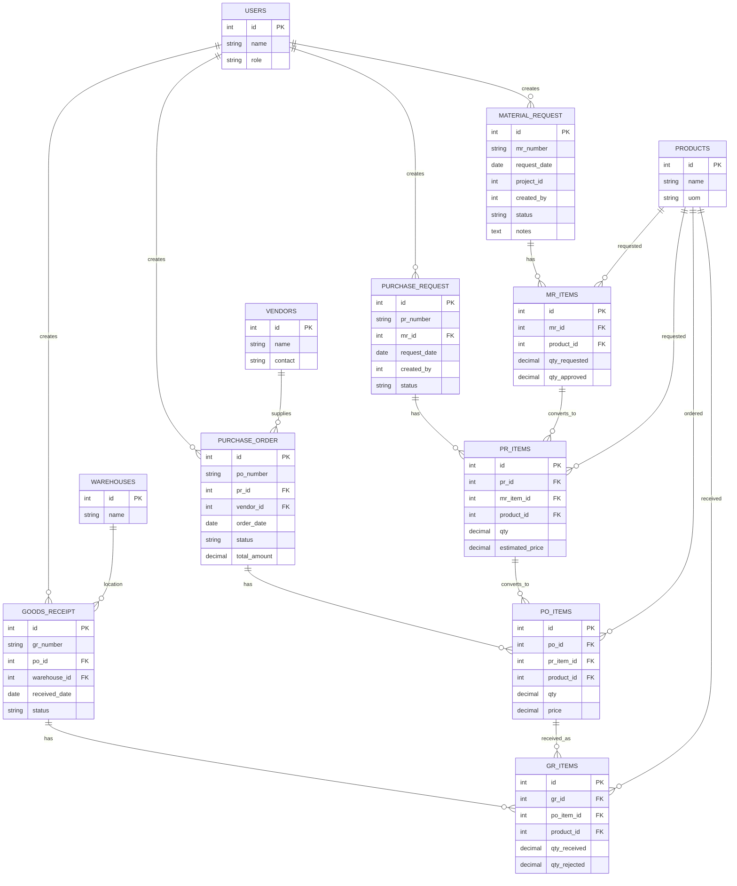

Berikut desain **ERD (Entity Relationship Diagram)** untuk modul:

**MR → PR → PO → GR**
dengan pendekatan yang siap diimplementasikan (relasional + scalable).

Saya sertakan:

* struktur tabel inti
* relasi
* best practice (normalisasi + audit)

---

# 🔷 1. Gambaran Relasi Utama

```
Material Request → Purchase Request → Purchase Order → Goods Receipt
        |                    |                    |                |
     MR Items            PR Items            PO Items         GR Items
```

---

# 🔷 2. ERD (Mermaid Diagram)



---

# 🔷 3. Penjelasan Desain (Penting)

## ✅ 1. Relasi Bertingkat (Traceability)

* MR → PR → PO → GR **tidak langsung**, tapi lewat item:

  * `mr_items → pr_items → po_items → gr_items`

👉 Ini penting untuk:

* tracking per item
* partial order
* partial delivery

---

## ✅ 2. Status per Dokumen

Semua tabel utama punya:

```
status:
- draft
- submitted
- approved
- rejected
- closed
```

---

## ✅ 3. Audit Trail (WAJIB TAMBAH)

Tambahkan kolom:

```
created_at
created_by
approved_at
approved_by
rejected_at
rejected_by
```

Atau buat tabel:

```
approval_logs
- document_type (MR, PR, PO, GR)
- document_id
- action
- user_id
- timestamp
- notes
```

---

## ✅ 4. Budget Control (Opsional tapi penting)

Tambahkan ke PR:

```
budget_code
project_id
cost_center
```

---

## ✅ 5. Inventory Integration

Tambahkan tabel:

```
stock_movements
- product_id
- warehouse_id
- qty_in
- qty_out
- reference_type (GR / Issue)
- reference_id
```

---

# 🔷 4. Relasi Kritis (Sering Salah)

### ❌ Jangan:

* GR langsung ke PR ❌
* PO tanpa PR ❌ (kecuali special case)

### ✅ Harus:

* GR → PO → PR → MR

---

# 🔷 5. Skalabilitas (Best Practice)

Kalau sistem akan besar:

### Pisahkan:

* `projects`
* `cost_centers`
* `uom`
* `currency`

### Gunakan:

* UUID untuk distributed system
* soft delete (`deleted_at`)

---

# 🔷 6. Bonus: Role Mapping ke Database

Tambahkan tabel:

```
roles
permissions
user_roles
```

Contoh:

* Site Engineer → create MR
* PM → approve MR
* Procurement → create PO
* Warehouse → create GR

---

# 🔷 7. Kalau Mau Lebih Advance

Saya bisa bantu lanjut ke:

* 🔹 **ERD versi production (dengan indexing & constraint detail)**
* 🔹 **DDL SQL (PostgreSQL / MySQL)**
* 🔹 **API design (REST / GraphQL)**
* 🔹 **State machine per modul**

Tinggal bilang mau lanjut ke mana 👍
